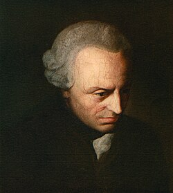

# KL1 in C

A tiny interactive implementation of KL1 logic in plain C.
**KL1** is a non-classical logic by R. Evans, M.Sergot and A.Stephenson, which formalizes **cognitive acts** as the basic units of inference. Developed to model Kant’s conception of rules in the *Critique of Pure Reason*, KL1 treats rules as **procedures** for generating acts (such as *subsumptions*) conditionally on other acts.
Unlike standard deontic or truth-functional logics, KL1 does not assume that atoms have truth values. Instead, it captures the structure of norm-governed mental activity and models how an agent constructs a coherent representation of the world by applying rules to acts—such as perceiving, subsuming, or identifying patterns in sensory input.
KL1 is part of a broader formal architecture (KL1–KL3) for modeling Kantian cognition computationally.

📄 **Full paper:**  
[Formalizing Kant’s Rules: A Logic of Conditional Imperatives and Permissives (Evans, Sergot, Stephenson)](https://link.springer.com/article/10.1007/s10992-019-09531-x)

You provide:
- a set of facts `A` (atoms)
- a set of rules `R` (imperative ⊢ or permissive ⊣)

It computes:
- `def(R)` — all definite programs derived from R
- `cnsᵈ(R,A)` — all least models M(D,A) for D in def(R)
- `out₁(R,A)` — all models that satisfy all constraints

## How to build

```sh
gcc kl1.c -o kl1
